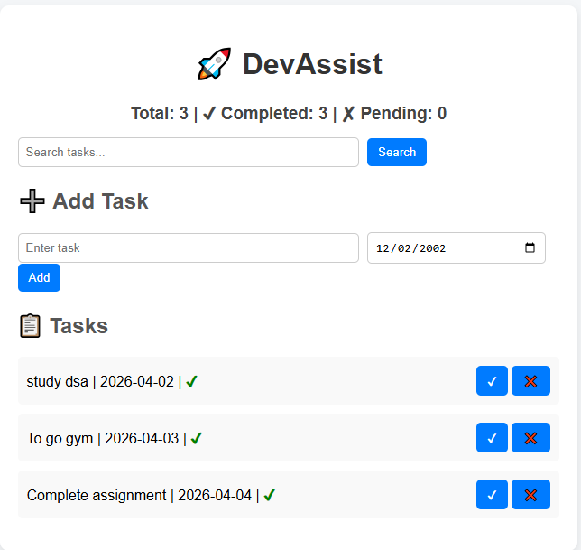

# 🚀 DevAssist - Task Manager Web App

A Flask-based productivity web app built while learning web development, featuring task and note management, search functionality, deadlines, and a clean UI.

---

## 🔥 Features

### 📋 Task Management
- Add tasks with deadlines
- Mark tasks as completed
- Delete tasks
- Overdue task detection

### 📝 Notes Management
- Add notes
- Edit notes
- Delete notes
- Search notes

### 🔍 Utilities
- Search tasks by keyword
- File search functionality
- Task statistics (total, completed, pending)

### 🎨 UI
- Clean and responsive interface

## 🌐 Live Demo

🔗 [Click here to open DevAssist](https://devassist-qyr4.onrender.com)

## 📸 Screenshots

### 🏠 Home Page

